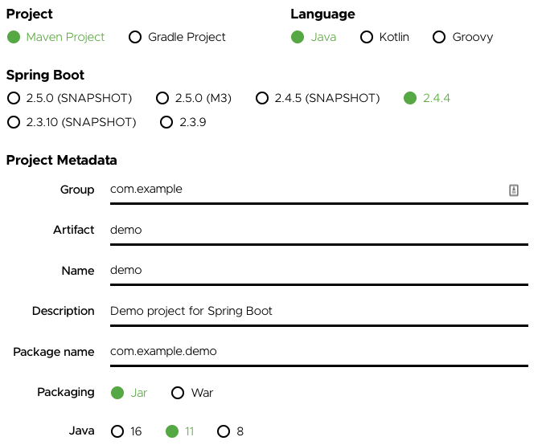

# spring-boot-2-initd-and-launch-script


## Outline

- spring-boot-demo
- spring-boot-logback
- spring-boot-logback-spring-profile

## Background and objectives

While packaging the Spring Boot application jar, there is a feature of packaging as the executable jar. And after that, when boot up the application, there are couples of options offering by Spring Boot - "Deploying Spring Boot Applications".

- To understand the topic of "Deploying Spring Boot Applications" - https://docs.spring.io/spring-boot/docs/current/reference/html/deployment.html, especially the way of init.d (System V);
- To understand the Spring Boot launch script or start up script; compare the different Spring Boot versions (1.5.x and 2.3.x)
- To understand the difference between "runnable jar" and "executable jar", and what Spring framework does for the jar;
- To understand the logging systems classes in the Spring Boot; test with Logback.

## Useful links

- https://docs.spring.io/spring-boot/docs/current/reference/html/deployment.html#deployment-service
- https://start.spring.io/ - to initialize the Spring Boot application
- https://github.com/spring-projects/spring-boot/tree/2.3.x - source code of Spring Boot 2.3.x
- https://github.com/spring-projects/spring-boot/tree/1.5.x - source code of Spring Boot 1.5.x
- https://github.com/qos-ch/logback - source code of Logback

## Preparation

- Download source code of Spring Boot 1.5.x
- Download source code of Spring Boot 2.3.x
- Download source code of Logback (any version is applied, here uses version 1.3.x)
- Download Spring Boot application as this selection demo,
  - 
  - after that modify the code a bit to print out the log

## Runnable jar and executable jar

### How to make executable jar

- https://docs.spring.io/spring-boot/docs/current/reference/html/deployment.html#deployment-install
  - Maven plugin
  - Gradle plugin

Maven plugin

```xml
<plugin>
    <groupId>org.springframework.boot</groupId>
    <artifactId>spring-boot-maven-plugin</artifactId>
    <configuration><!-- for executable jar -->
        <executable>true</executable>
    </configuration>
</plugin>
```

Gradle plugin

```groovy
bootJar {
    launchScript()
}
```

### Difference

```bash
sdk list java # to use 11.0.10-zulu
sdk install java 11.0.10-zulu
java -version # looking for Java 11

cd spring-boot-demo
./mvnw clean package
cd target && ls
# classes                          demo-0.0.1-SNAPSHOT.jar.original generated-test-sources           maven-status                     test-classes
# demo-0.0.1-SNAPSHOT.jar          generated-sources                maven-archiver                   surefire-reports

# now it is the runnable jar
java -jar spring-boot-demo-0.0.1-SNAPSHOT.jar
chmod +x spring-boot-demo-0.0.1-SNAPSHOT.jar
./spring-boot-demo-0.0.1-SNAPSHOT.jar       
zsh: exec format error: ./spring-boot-demo-0.0.1-SNAPSHOT.jar

cd ..

# now it is the executable jar
vi pom.xml # to include <executable>true</executable>
./mvnw clean package
cd target
java -jar spring-boot-demo-0.0.1-SNAPSHOT.jar
chmod +x spring-boot-demo-0.0.1-SNAPSHOT.jar
./spring-boot-demo-0.0.1-SNAPSHOT.jar # now this one also running

# you can run java tvf to view the inside of the jar
jar tvf spring-boot-demo-0.0.1-SNAPSHOT.jar # Launcher.class, JarLauncher.class, ExecutableArchiveLauncher.class
```

### What does happen in Spring Boot for executable jar

The template of the shell script is as - https://github.com/spring-projects/spring-boot/blob/master/spring-boot-project/spring-boot-tools/spring-boot-loader-tools/src/main/resources/org/springframework/boot/loader/tools/launch.script

In source code `/spring-boot-tools/spring-boot-loader-tools/src/main/resources/org/springframework/boot/loader/tools`

Search `launch.script` in source code -> `DefaultLaunchScript`, this is the place that when do packaging, it will get this file by default.
It is also possible to get `/spring-boot-tools/spring-boot-maven-plugin/src/it/jar-custom-launcher/src/launcher` for the custom script.

Spring Boot 2.3.x is with `{{inlinedConfScript:}}`, so it is no need to replace the whole script, but it can be embedded that inline script.
This one is not on 1.5.x.

### How to use environment variables with the Service Mode

Use the environment variable when doing runtime - https://docs.spring.io/spring-boot/docs/current/reference/html/deployment.html#deployment-script-customization-when-it-runs

`MODE`
  - default is `auto`, assume it is using `init.d`. It is still possible run it as ./xxx.jar in the command line by yourself.
  - set to `service`, if you want to run it in background, must provide actions of start, stop, status, etc.

```bash
# ----------------------------------------
# The SpringBoot assume this will be executed by init.d.
# You still can run it directly as executable jar, but it would not act as background service as init.d
# ----------------------------------------
export DEBUG=ANY_VALUE # it set +x for bash debug
export ROOT_FOLDER="$HOME/spring-boot-demo-0.0.1-SNAPSHOT"
mkdir "$ROOT_FOLDER" # set it if you do not have the permission to write the log file into /var/log
export LOG_FOLDER="$ROOT_FOLDER" # if folder does not exist, it falls down to /var/log
export PID_FOLDER="$ROOT_FOLDER" # if folder does not exist, it falls down to /tmp
./spring-boot-demo-0.0.1-SNAPSHOT.jar
ls ~/spring-boot-demo-0.0.1-SNAPSHOT # nothing

# ----------------------------------------
# Simulate running as the background service.
# In case you are running this in Mac without init.d
# ----------------------------------------
export MODE=service
./spring-boot-demo-0.0.1-SNAPSHOT.jar start # it is the service mode, need to use xxx.jar 
# now it will write log and pid file into "$ROOT_FOLDER"
ls ~/spring-boot-demo-0.0.1-SNAPSHOT # now can see some files
./spring-boot-demo-0.0.1-SNAPSHOT.jar stop # will remove the pid file
export APP_NAME=spring-boot-demo # make the log file $APP_NAME.log, and pid file as $APP_NAME.pid
# console log redirects to $LOG_FOLDER, default is /var/log
```

How does log file happen - ">>" the console log then inside the "launch.script"

## Deploying Spring Boot Applications

### Installing Spring Boot applications

Possible registered init.d or systemd, when start the application as executable jar.

> Fully executable jars work by embedding an extra script at the front of the file

### How does register into init.d as Linux/Unix service

- application is as executable jar
- sudo ln -s /xxx/<appname>.jar /etc/init.d/<appname>
- assign the ownership for the application, log file, and PID file
- when start, by default write log to "/var/log/<appname>.log" (as default when it is running background `service`)
- service <appname> start (this also relates to "MODE" in https://docs.spring.io/spring-boot/docs/current/reference/html/deployment.html#deployment-script-customization-when-it-runs)

About "systemd" it is with similar concept. For the application part it is the same. The Linux/Unit part, it is with a separated configuration file for systemd.

## Logging systems

Refer to `spring-boot-project/spring-boot/src/main/java/org/springframework/boot/logging/LoggingSystem.java`

### How does the Logback configuration work

- Logback
  - http://logback.qos.ch/manual/configuration.html
  - > Assuming the configuration files logback-test.xml or logback.xml are not present, logback will default to invoking BasicConfigurator which will set up a minimal configuration. This minimal configuration consists of a ConsoleAppender attached to the root logger. The output is formatted using a PatternLayoutEncoder set to the pattern %d{HH:mm:ss.SSS} [%thread] %-5level %logger{36} - %msg%n. Moreover, by default the root logger is assigned the DEBUG level.
  - it uses the programmatically way to register those configuration.

- Spring pre-defined configuration - https://github.com/spring-projects/spring-boot/tree/master/spring-boot-project/spring-boot/src/main/resources/org/springframework/boot/logging/logback

- make copy from `spring-boot-demo`
  - `spring-boot-logback` - use with Logback XML only
  - `spring-boot-logback-spring-profile` - use with Logback XML and Spring Profile (Spring Profile)

```bash
export DEBUG= # disable debugging
export ROOT_FOLDER="$HOME/spring-boot-demo-0.0.1-SNAPSHOT"
mkdir "$ROOT_FOLDER"
export LOG_FOLDER="$ROOT_FOLDER"
export PID_FOLDER="$ROOT_FOLDER"
export APP_NAME=spring-boot-demo

export MODE=service

# spring-boot-demo
cd spring-boot-demo
./mvnw clean package && cd target
chmod +x spring-boot-demo-0.0.1-SNAPSHOT.jar

java -jar spring-boot-demo-0.0.1-SNAPSHOT.jar # CONSOLE log in logback default log configuration
# java -jar spring-boot-demo-0.0.1-SNAPSHOT.jar & # also same as "java -jar spring-boot-demo-0.0.1-SNAPSHOT.jar"
./demo-0.0.1-SNAPSHOT.jar start # CONSOLE log in logback default log configuration

# demo-logback-xml
cd ../../demo-logback-xml
./mvnw clean package && cd target && chmod +x demo-logback-xml-0.0.1-SNAPSHOT.jar

./demo-logback-xml-0.0.1-SNAPSHOT.jar start
cat /tmp/spring-boot-demo.log
cat $HOME/spring-boot-demo-0.0.1-SNAPSHOT/spring-boot-demo.log # CONSOLE log because launch.script
rm /tmp/spring-boot-demo.log
rm $HOME/spring-boot-demo-0.0.1-SNAPSHOT/spring-boot-demo.log

# demo-logback-spring-xml
export spring_profiles_active=production # enable the spring profile

cd ../../spring-boot-demo-logback-spring-xml
./mvnw clean package && cd target
chmod +x spring-boot-demo-logback-spring-xml-0.0.1-SNAPSHOT.jar

./spring-boot-demo-logback-spring-xml-0.0.1-SNAPSHOT.jar start
cat /tmp/spring-boot-demo.log
cat $HOME/spring-boot-demo-0.0.1-SNAPSHOT/spring-boot-demo.log # CONSOLE log because launch.script
rm /tmp/spring-boot-demo.log
rm $HOME/spring-boot-demo-0.0.1-SNAPSHOT/spring-boot-demo.log
```

## Summary

Assume the jar is packaged with the executable options

| Execution option    | MODE          | Executed by  | Triggered launch.script           | PID file       | Logging                                                           |
|---------------------|---------------|--------------|-----------------------------------|----------------|-------------------------------------------------------------------|
| java -jar xxx.jar   | Do not matter | Command line | No                                | Not generating | Control by application log settings                               |
| java -jar xxx.jar & | Do not matter | Command line | No                                | Not generating | Control by application log settings                               |
| ./xxx.jar           | auto          | Command line | Yes (using way of executable jar) | Not generating | Control by application log settings                               |
| ./xxx.jar &         | auto          | Command line | Yes (using way of executable jar) | Not generating | Control by application log settings                               |
| ./xxx.jar           | auto          | init.d       | Yes (using way of executable jar) | Generating     | Console log is redirected by launch.script to /var/log as default |
| ./xxx.jar start     | service       | Command line | Yes (using way of executable jar) | Generating     | Console log is redirected by launch.script to /var/log as default |
| ./xxx.jar start &   | service       | Command line | Yes (using way of executable jar) | Generating     | Console log is redirected by launch.script to /var/log as default |

## Execute all tests in repo

`/bin/bash run-repo-test.sh`
